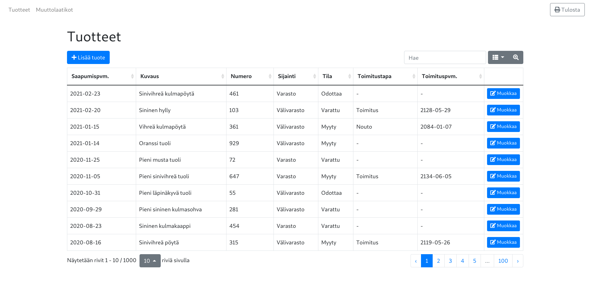

# Varastonhallinta
Simple warehouse management system.

## Prerequisites
Requires a browser (engine). Chromium is recommended for running in app mode.

## Usage
All arguments are optional.

    usage: varastonhallinta.py [-h] [--database PATHNAME] [--backup PATHNAME]
                               [--server-only | --client-only [{http,https}]]
                               [--debug] [--translogger] [--version] [--host HOST]
                               [--port PORT] [--flowinfo FLOWINFO]
                               [--scope_id SCOPE_ID]
                               [--runtime {firefox-browser,firefox-app,nw-app...}]
                               [--window-size X Y] [--window-pos X Y]
                               [--window-mode {normal,maximized,fullscreen,kiosk}]

    Warehouse Management System

    optional arguments:
      -h, --help            show this help message and exit
      --database PATHNAME   relative or absolute path to a database file (defaults
                            to using an .sqlite3 file within user application data
                            directory)
      --backup PATHNAME     backup and exit
      --server-only         run in server mode
      --client-only [{http,https}]
                            run in client mode [URI scheme (default: http)]
      --debug               enable DEBUG logging level
      --translogger         enable request logging
      --version             output version and exit

    socket address:
      AF_INET6 address family

      --host HOST           host (default: ::1)
      --port PORT           port (default: 0 (bind to a free port provided by the
                            operating system))
      --flowinfo FLOWINFO   flow label
      --scope_id SCOPE_ID   scope identifier (e.g. interface number for link-local
                            addresses)

    client options:
      see Webruntime's documentation

      --runtime {firefox-browser,firefox-app,nw-app...}
                            browser or desktop-like runtime (default: chrome-app,
                            fallback: browser)
      --window-size X Y     initial window size (default: 1920 1080)
      --window-pos X Y      initial window position
      --window-mode {normal,maximized,fullscreen,kiosk}
                            initial window mode (not all modes are supported by
                            all runtimes)
    
## Build Procedure
The following is for typical GNU/Linux systems. Adapt for other platforms.

    git clone https://github.com/ninlith/varastonhallinta.git
    cd varastonhallinta
    sudo apt install python3-dev python3-venv
    python3 -m venv venv
    source venv/bin/activate
    pip install -r requirements.txt 
    cd varastonhallinta
    pyinstaller --onefile --add-data "auxiliary:auxiliary" --add-data "wsgi:wsgi" \
        --hidden-import "colorlog" varastonhallinta.py
        
## License
GNU GPLv3 only
